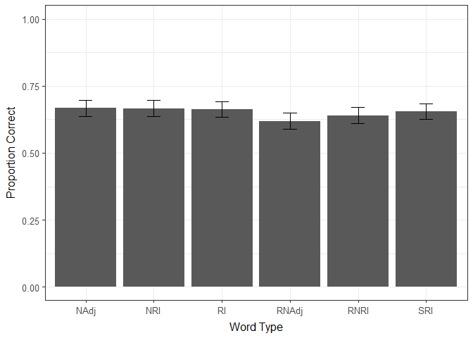
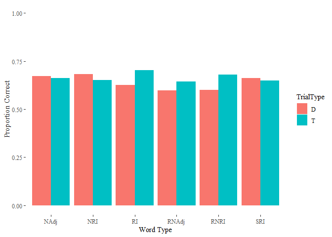
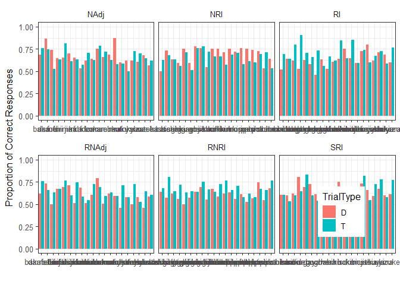
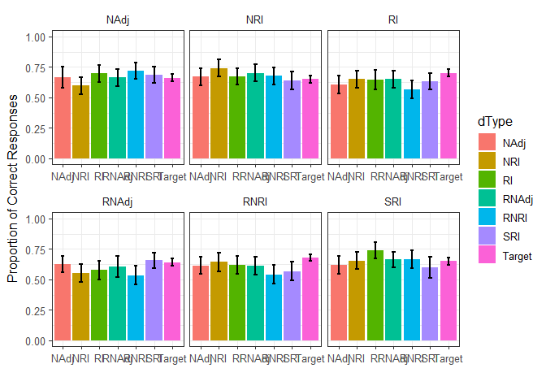
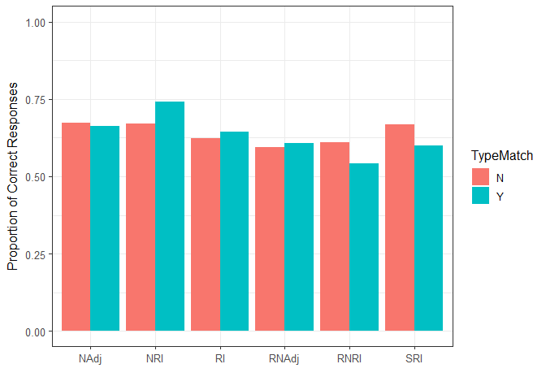
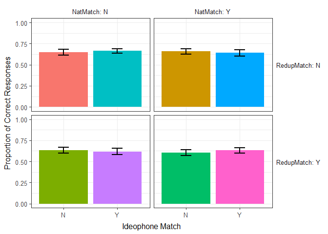
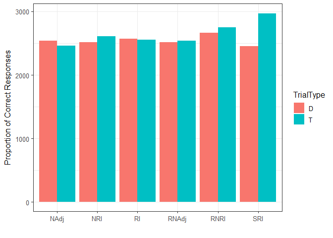

# Data Cleaning


---
# Introduction

At long last, the data from our collaboration exploring the effects of Iconicity and Reduplication on the learnability of Japanese Ideophones. Recall that for this experiemnt we were primairly interested in what drives the learnability advantage for Reduplicative Ideophones observed in previous studies. Our suggestion was that iconicity and reduplication might be double-dipping a learning advantage, with both providing advantages to learners that couldn't be captures by analyses of previous studies.

And so we set out for this ambitious study, collecting data from 260 participants via mechanical turk (plus a large number of pilot participants whose data we can include or exclude depending on how we feel about that).

To rehearse, we collected real Japanese words of 3 types (20 of each): Reduplicative Ideophones, Non-Reduplicative Ideophones, and Normal Adjectives

From this set of words we created three additional sets that we hoped would allow us to disentangle the effects of Reduplication and Iconicity:

Split Reduplicative Ideophones, Reduplicated Non-Reduplicative Ideophones (Artificially Reduplicated Ideophones?), and Reduplicated Normal Adjectives

WIth these stimuli in hand, we followed the same basic experimental design as some of Mark's previous work - participants were presented with learning trials during which they were trained on associations between Japanese words and English meanings, and afterwards they were presented with testing trials where there were shown either a target pairing or a distractor pairing (Japanese word presented with another meaning(chosen randomly from their set of meanings) and asked simply whether the presented pairing was correct (Familiar) or incorrect (unfamiliar))

*for further details on the process of how these individual word pairings, randomisation, etc was completed, please refer to the other R Markdown files in the GitHub repository*

Briefly, we outlined a number of possible hypotheses that we hoped this data could disambiguate between (listed below along with evidence we could find in support of those hypotheses):

## 1- Reduplication is, itself, iconic

This suggests that there is a reason that cerrtain meanings have reduplicative forms in japanese, while others do not

Possible support/predictions:

a) Reduplicative Ideophones (RI) should be learned better than their split counterparts (SRI)
b) Non-Reduplicative Ideophones (NRI) should be learned equally as well as their artificially reduplicated counterparts (RNRI)
c) Normal Adjectives (NAdj) and their reduplicated counterparts (RNAdj) should be learned equally well to each other

## 2- Reduplication is a systematic disambiguating cue

The idea here is that reduplication is a signpost- it points to something internal about a word and says to the learner "this is a safe place to look for iconicity"

Posisble support/predictions:
a) Reduplicative Ideophones (RI) should be learned better than their split counterparts (SRI)
b) Reduplicated Non-Reduplicative Ideophones (RNRI) should be learned better than their natural counterparts (NRI)
c) Reduplicated and Normal adjectives should be learned equally well

## 3- Reduplication aids in memorability (but has nothing to do with iconicity)

a) All reduplicated words, whether natural or not, should be learned better than their non-reduplicated counterparts (RI > SRI, RNAdj> NAdj, RNRI > NRI)

Below here I undertake a number of statistical tests and visualisations that explore what we actually found (Spoiler - not much!)

# Descriptive Statistics

## A first look


```r
tapply(allTesting$Correct, allTesting$WordType, mean)
```

```
##                NAdj       NRI        RI     RNAdj      RNRI       SRI 
##        NA 0.6668269 0.6663462 0.6634615 0.6192308 0.6399038 0.6552885
```

```r
allTestingAgg <- aggregate(Correct ~ WordType ,
                  data= allTesting, 
                  mean)

allTestingAggSD <- aggregate(Correct ~ WordType ,
                  data= allTesting, 
                  sd)

allTestingAgg$SE <- allTestingAggSD$Correct/sqrt(length(unique(allTesting$ParticipantID)))

ggplot(data=allTestingAgg, aes(x=WordType, y=Correct), group = 6) +
  geom_bar(stat = "summary", fun.y = "mean") +
  geom_errorbar(aes(ymin= Correct - SE, ymax= Correct + SE, width = 0.2)) +
  labs(x="Word Type", y="Proportion Correct") +
  guides(colour=FALSE) +
  scale_y_continuous(breaks = c(0, 0.25, 0.5, 0.75, 1.00), limits = c(0,1)) +
  theme_alan()
```

<!-- -->

At a first look, there is shockingly little going on with our data. Obviously it's hard to pick out statistical values from a visualisation, but nothing stands out in terms of an *inter-ocular* statistical test. If anything it looks like Reduplicated Normal Adjectives might have the lowest performance

Recall of course that our design is within-subjects - so all participants see trials for each type of word in the experiment. Specifically, they learn 4 of each word type, then during testing are given a total of 8 trials for each word type - one target trial (word is paired with its correct meaning) and one distractor trial (word is paired with its incorrectt meaning)

Lets take a quick look at differences between targets and distractors


```r
allTestingAgg2 <- aggregate(Correct ~ WordType + TrialType,
                  data= allTesting, 
                  mean)

allTestingAggSD2 <- aggregate(Correct ~ WordType + TrialType ,
                  data= allTesting, 
                  sd)

allTestingAgg2$SE <- allTestingAgg$Correct/sqrt(216)

library(ggplot2)
library(ggthemes)


ggplot(data=allTestingAgg2, aes(x=WordType, y=Correct), group = 6) +
  geom_bar(stat = "summary", fun.y = "mean", aes(fill = TrialType), position = position_dodge(width=0.9)) +
  #geom_errorbar(aes(ymin= Correct - SE, ymax= Correct + SE, width = 0.2), position = position_dodge(width=0.9)) +
  labs(x="Word Type", y="Proportion Correct") +
  scale_y_continuous(breaks = c(0, 0.25, 0.5, 0.75, 1.00), limits = c(0,1)) +
  theme_tufte()
```

<!-- -->

Again there doesn't seem to be a lot of systematic bits going on here. In some cases performance is worse on targets and in some cases its worse on distractors, but this looks like it might just be noise.

But enough talk of "looks like" - lets check out some statistics and see what falls out

## Basic Statistics - Main Effect of Word Type on Learning


```r
afex1 <- mixed(Correct ~ WordType + (1|ParticipantID),
                         data=allTesting,
                         family=binomial,
                         control=glmerControl(optimizer="bobyqa"),
                         method = 'LRT',
                         progress=FALSE)

##ANOVA Table for P Values of Main effects and Interactions
afex1$anova_table %>% 
  data.frame() %>% 
    tibble::rownames_to_column(var= "Variable") %>% 
      mutate_if(is.numeric, round, digits = 3) %>% 
        mutate_all(funs(ifelse(.<0.001, "<0.001", .))) %>%
          `colnames<-`(c("Variable", "df", "Chi Sq", "Chi df", "p")) %>%
            knitr::kable(caption = "Word Type Comparison", ) %>%
              kable_styling(full_width= F)
```

<table class="table" style="width: auto !important; margin-left: auto; margin-right: auto;">
<caption>Word Type Comparison</caption>
 <thead>
  <tr>
   <th style="text-align:left;"> Variable </th>
   <th style="text-align:right;"> df </th>
   <th style="text-align:right;"> Chi Sq </th>
   <th style="text-align:right;"> Chi df </th>
   <th style="text-align:right;"> p </th>
  </tr>
 </thead>
<tbody>
  <tr>
   <td style="text-align:left;"> WordType </td>
   <td style="text-align:right;"> 2 </td>
   <td style="text-align:right;"> 17.707 </td>
   <td style="text-align:right;"> 5 </td>
   <td style="text-align:right;"> 0.003 </td>
  </tr>
</tbody>
</table>

```r
##Fixed Effects 
summary(afex1)$coefficients  %>%
  data.frame() %>%
    tibble::rownames_to_column(var= "FixedEffect") %>% 
    mutate(FixedEffect = recode_factor(FixedEffect, 
                                       `WordTypeNRI` = "Non-Reduplicative Ideophones",
                                       `WordTypeRI` = "Reduplicative Ideophones",
                                       `WordTypeRNAdj` = "Reduplicated Normal Adjectives",
                                       `WordTypeRNRI` = "Reduplicated Non-Reduplicative Ideophones",
                                       `WordTypeSRI` = "Split Reduplicative Ideophones")) %>%
      `colnames<-`(c("Fixed Effect", "Estimate", "SE", "z", "p")) %>%
        mutate_if(is.numeric, round, digits = 3) %>% 
          mutate_at("p", funs(ifelse(.<0.001, "<0.001", .))) %>%
            knitr::kable(caption = "Word Type Comparison- Fixed Effects Table", ) %>%
              kable_styling(full_width= F) %>%
                pack_rows("Intercept", 1, 1) %>%
                  pack_rows("Word Types", 2, 6) 
```

<table class="table" style="width: auto !important; margin-left: auto; margin-right: auto;">
<caption>Word Type Comparison- Fixed Effects Table</caption>
 <thead>
  <tr>
   <th style="text-align:left;"> Fixed Effect </th>
   <th style="text-align:right;"> Estimate </th>
   <th style="text-align:right;"> SE </th>
   <th style="text-align:right;"> z </th>
   <th style="text-align:left;"> p </th>
  </tr>
 </thead>
<tbody>
  <tr grouplength="1"><td colspan="5" style="border-bottom: 1px solid;"><strong>Intercept</strong></td></tr>
<tr>
   <td style="text-align:left; padding-left: 2em;" indentlevel="1"> (Intercept) </td>
   <td style="text-align:right;"> 0.777 </td>
   <td style="text-align:right;"> 0.065 </td>
   <td style="text-align:right;"> 11.991 </td>
   <td style="text-align:left;"> &lt;0.001 </td>
  </tr>
  <tr grouplength="5"><td colspan="5" style="border-bottom: 1px solid;"><strong>Word Types</strong></td></tr>
<tr>
   <td style="text-align:left; padding-left: 2em;" indentlevel="1"> Non-Reduplicative Ideophones </td>
   <td style="text-align:right;"> -0.002 </td>
   <td style="text-align:right;"> 0.068 </td>
   <td style="text-align:right;"> -0.034 </td>
   <td style="text-align:left;"> 0.973 </td>
  </tr>
  <tr>
   <td style="text-align:left; padding-left: 2em;" indentlevel="1"> Reduplicative Ideophones </td>
   <td style="text-align:right;"> -0.016 </td>
   <td style="text-align:right;"> 0.068 </td>
   <td style="text-align:right;"> -0.240 </td>
   <td style="text-align:left;"> 0.81 </td>
  </tr>
  <tr>
   <td style="text-align:left; padding-left: 2em;" indentlevel="1"> Reduplicated Normal Adjectives </td>
   <td style="text-align:right;"> -0.226 </td>
   <td style="text-align:right;"> 0.067 </td>
   <td style="text-align:right;"> -3.347 </td>
   <td style="text-align:left;"> 0.001 </td>
  </tr>
  <tr>
   <td style="text-align:left; padding-left: 2em;" indentlevel="1"> Reduplicated Non-Reduplicative Ideophones </td>
   <td style="text-align:right;"> -0.129 </td>
   <td style="text-align:right;"> 0.068 </td>
   <td style="text-align:right;"> -1.906 </td>
   <td style="text-align:left;"> 0.057 </td>
  </tr>
  <tr>
   <td style="text-align:left; padding-left: 2em;" indentlevel="1"> Split Reduplicative Ideophones </td>
   <td style="text-align:right;"> -0.056 </td>
   <td style="text-align:right;"> 0.068 </td>
   <td style="text-align:right;"> -0.821 </td>
   <td style="text-align:left;"> 0.412 </td>
  </tr>
</tbody>
</table>

```r
#### DESCRIPTIVES AND POST HOC TESTS
#Word Types
##Word Types Descriptives
alldata.WordType <- summarySE(data=allTesting,
                             measurevar = "Correct",
                             groupvars = "WordType")

alldata.WordType.EM <- emmeans(afex1, ~WordType)

##WordTypes vs. Chance
alldata.WordType.vchance <- test(alldata.WordType.EM, adjust = "none")

##Condition vs. Each Other
alldata.WordType.vPairs <- data.frame(pairs(alldata.WordType.EM, adjust = "none" ))

###Normal Adjective Baseline
alldata.WordType.vPairs.NAdjB <- 
  rbind(rep(NA,6),alldata.WordType.vPairs[1:5,])

###Non-Reduplicative Ideophone Baseline
alldata.WordType.vPairs.NRIB <-
  rbind(alldata.WordType.vPairs[1,], rep(NA,6), alldata.WordType.vPairs[6:9,])

###Reduplicative Ideophone Baseline
alldata.WordType.vPairs.RIB <-
  rbind(alldata.WordType.vPairs[2,], alldata.WordType.vPairs[6,], rep(NA,6), alldata.WordType.vPairs[10:12,])

###Reduplicated Normal Adjective Baseline

alldata.WordType.vPairs.RNAdjB <-
  rbind(alldata.WordType.vPairs[3,], alldata.WordType.vPairs[7,], alldata.WordType.vPairs[10,], rep(NA,6), alldata.WordType.vPairs[13:14,])


###Reduplicated Non-Reduplicative Ideophone Baseline

alldata.WordType.vPairs.RNRIB <-
  rbind(alldata.WordType.vPairs[4,], alldata.WordType.vPairs[8,], alldata.WordType.vPairs[11,], alldata.WordType.vPairs[13,], rep(NA,6), alldata.WordType.vPairs[15,])

###Split Reduplicative Ideophone Baseline
alldata.WordType.vPairs.SRIB <-
  rbind(alldata.WordType.vPairs[5,],alldata.WordType.vPairs[9,],alldata.WordType.vPairs[12,],alldata.WordType.vPairs[14,],alldata.WordType.vPairs[15,], rep (NA,6))
  
###Creating a single dataframe for Word Types
alldata.WordType.Combo <- cbind.data.frame (
  alldata.WordType$WordType, alldata.WordType$N, alldata.WordType$Correct, alldata.WordType$se,
  alldata.WordType.vchance$z.ratio, alldata.WordType.vchance$p.value,
  alldata.WordType.vPairs.NAdjB$p.value,
  alldata.WordType.vPairs.NRIB$p.value,
  alldata.WordType.vPairs.RIB$p.value,
  alldata.WordType.vPairs.RNAdjB$p.value,
  alldata.WordType.vPairs.RNRIB$p.value,
  alldata.WordType.vPairs.SRIB$p.value
)


colnames(alldata.WordType.Combo) <- c("Word Type", "n", "Mean", "SE", 
                                      "v Chance (z score)", "v Chance (p val)",
                                "NAdj", "NRI", "RI", 
                                "RNAdj", "RNRI", "SRI"
                                )

###Knitting Condition Table
alldata.WordType.Combo %>%  
  mutate_if(is.numeric, round, 3) %>%
    mutate_at(.vars = vars("v Chance (z score)"), round, 2)%>%
    mutate_at(.vars = vars("v Chance (p val)", 
                           "NAdj", "NRI", "RI", 
                                "RNAdj", "RNRI", "SRI"),
        funs(ifelse(.<0.001, "<0.001", .))) %>%
          knitr::kable(caption = 'Mits Mark Experiment - Descriptive Statistics - Word Type', "html") %>%
            kable_styling(full_width = F) %>%
              add_header_above(c("", "Descriptive Stats" = 3, "Comparison to Chance" = 2, "Comparisons vs. Other Word Types (p values)" = 6),
                   font_size = 12)
```

<table class="table" style="width: auto !important; margin-left: auto; margin-right: auto;">
<caption>Mits Mark Experiment - Descriptive Statistics - Word Type</caption>
 <thead>
<tr>
<th style="border-bottom:hidden" colspan="1"></th>
<th style="border-bottom:hidden; padding-bottom:0; padding-left:3px;padding-right:3px;text-align: center; font-size: 12px;" colspan="3"><div style="border-bottom: 1px solid #ddd; padding-bottom: 5px; ">Descriptive Stats</div></th>
<th style="border-bottom:hidden; padding-bottom:0; padding-left:3px;padding-right:3px;text-align: center; font-size: 12px;" colspan="2"><div style="border-bottom: 1px solid #ddd; padding-bottom: 5px; ">Comparison to Chance</div></th>
<th style="border-bottom:hidden; padding-bottom:0; padding-left:3px;padding-right:3px;text-align: center; font-size: 12px;" colspan="6"><div style="border-bottom: 1px solid #ddd; padding-bottom: 5px; ">Comparisons vs. Other Word Types (p values)</div></th>
</tr>
  <tr>
   <th style="text-align:left;"> Word Type </th>
   <th style="text-align:right;"> n </th>
   <th style="text-align:right;"> Mean </th>
   <th style="text-align:right;"> SE </th>
   <th style="text-align:right;"> v Chance (z score) </th>
   <th style="text-align:left;"> v Chance (p val) </th>
   <th style="text-align:right;"> NAdj </th>
   <th style="text-align:right;"> NRI </th>
   <th style="text-align:right;"> RI </th>
   <th style="text-align:right;"> RNAdj </th>
   <th style="text-align:right;"> RNRI </th>
   <th style="text-align:right;"> SRI </th>
  </tr>
 </thead>
<tbody>
  <tr>
   <td style="text-align:left;"> NAdj </td>
   <td style="text-align:right;"> 2080 </td>
   <td style="text-align:right;"> 0.667 </td>
   <td style="text-align:right;"> 0.010 </td>
   <td style="text-align:right;"> 11.99 </td>
   <td style="text-align:left;"> &lt;0.001 </td>
   <td style="text-align:right;"> NA </td>
   <td style="text-align:right;"> 0.973 </td>
   <td style="text-align:right;"> 0.810 </td>
   <td style="text-align:right;"> 0.001 </td>
   <td style="text-align:right;"> 0.057 </td>
   <td style="text-align:right;"> 0.412 </td>
  </tr>
  <tr>
   <td style="text-align:left;"> NRI </td>
   <td style="text-align:right;"> 2080 </td>
   <td style="text-align:right;"> 0.666 </td>
   <td style="text-align:right;"> 0.010 </td>
   <td style="text-align:right;"> 11.96 </td>
   <td style="text-align:left;"> &lt;0.001 </td>
   <td style="text-align:right;"> 0.973 </td>
   <td style="text-align:right;"> NA </td>
   <td style="text-align:right;"> 0.837 </td>
   <td style="text-align:right;"> 0.001 </td>
   <td style="text-align:right;"> 0.061 </td>
   <td style="text-align:right;"> 0.432 </td>
  </tr>
  <tr>
   <td style="text-align:left;"> RI </td>
   <td style="text-align:right;"> 2080 </td>
   <td style="text-align:right;"> 0.663 </td>
   <td style="text-align:right;"> 0.010 </td>
   <td style="text-align:right;"> 11.75 </td>
   <td style="text-align:left;"> &lt;0.001 </td>
   <td style="text-align:right;"> 0.810 </td>
   <td style="text-align:right;"> 0.837 </td>
   <td style="text-align:right;"> NA </td>
   <td style="text-align:right;"> 0.002 </td>
   <td style="text-align:right;"> 0.096 </td>
   <td style="text-align:right;"> 0.561 </td>
  </tr>
  <tr>
   <td style="text-align:left;"> RNAdj </td>
   <td style="text-align:right;"> 2080 </td>
   <td style="text-align:right;"> 0.619 </td>
   <td style="text-align:right;"> 0.011 </td>
   <td style="text-align:right;"> 8.64 </td>
   <td style="text-align:left;"> &lt;0.001 </td>
   <td style="text-align:right;"> 0.001 </td>
   <td style="text-align:right;"> 0.001 </td>
   <td style="text-align:right;"> 0.002 </td>
   <td style="text-align:right;"> NA </td>
   <td style="text-align:right;"> 0.149 </td>
   <td style="text-align:right;"> 0.011 </td>
  </tr>
  <tr>
   <td style="text-align:left;"> RNRI </td>
   <td style="text-align:right;"> 2080 </td>
   <td style="text-align:right;"> 0.640 </td>
   <td style="text-align:right;"> 0.011 </td>
   <td style="text-align:right;"> 10.09 </td>
   <td style="text-align:left;"> &lt;0.001 </td>
   <td style="text-align:right;"> 0.057 </td>
   <td style="text-align:right;"> 0.061 </td>
   <td style="text-align:right;"> 0.096 </td>
   <td style="text-align:right;"> 0.149 </td>
   <td style="text-align:right;"> NA </td>
   <td style="text-align:right;"> 0.278 </td>
  </tr>
  <tr>
   <td style="text-align:left;"> SRI </td>
   <td style="text-align:right;"> 2080 </td>
   <td style="text-align:right;"> 0.655 </td>
   <td style="text-align:right;"> 0.010 </td>
   <td style="text-align:right;"> 11.18 </td>
   <td style="text-align:left;"> &lt;0.001 </td>
   <td style="text-align:right;"> 0.412 </td>
   <td style="text-align:right;"> 0.432 </td>
   <td style="text-align:right;"> 0.561 </td>
   <td style="text-align:right;"> 0.011 </td>
   <td style="text-align:right;"> 0.278 </td>
   <td style="text-align:right;"> NA </td>
  </tr>
</tbody>
</table>
So the most basic statistical test we can run shows a main effect of Word Type (Chisq (5)= 17.07, p= 0.003), with closer examination via post hoc tests showing that Reduplicated Normal Adjectives are the most different from the other word types - performance on those types of words is significantly lower than performancce on all but Reduplicated Non-Reduplicative Adjectives (which were themselves learned marginally more poorly than almost everything else).

The effects in question look pretty small here - Reduplicated Normal adjectives are only learned about 4% worst than the other word types, so its hard to know what to make of this

However, "Word Type" is not monolithic in our data, because we're actually effectively looking at three factors (which aren't fully crossed) :

Ideo: Whether a word is an ideophone or not
Redup: Whether a word contains reduplication or not (irrespective of its source)
Nat: Whether a word is of a natural class or whether it has been experiemntally manipulated by us

Of note we're missing words that are none of the above (these would need to be japanese non-words paired to meanings) and words that are natural adn have reduplication, but are not ideophones (which we talked about but Mits suggested don't really exist and certainly not in any sufficient numbers)

Nonetheless, the lack of crossings here appears to cause some convergence issues in the models below.

## The Effects of Word TYpe (Factors)


```r
allTesting$Ideo <- mapvalues(allTesting$WordType,
                               from = c("RI", "SRI", "NRI", "RNRI", "NAdj", "RNAdj"),
                               to = c("Y", "Y", "Y", "Y", "N", "N"))


allTesting$Redup <- mapvalues(allTesting$WordType,
                               from = c("RI", "SRI", "NRI", "RNRI", "NAdj", "RNAdj"),
                               to = c("Y", "N", "N", "Y", "N", "Y"))

allTesting$Nat <- mapvalues(allTesting$WordType,
                               from = c("RI", "SRI", "NRI", "RNRI", "NAdj", "RNAdj"),
                               to = c("Y", "N", "Y", "N", "Y", "N"))


afex2 <- mixed(Correct ~ Ideo + Redup + Nat + (1|ParticipantID),
                         data=allTesting,
                         family=binomial,
                         control=glmerControl(optimizer="bobyqa"),
                         method = 'LRT',
                         progress=FALSE,
                         all_fit= TRUE)

##ANOVA Table for P Values of Main effects and Interactions
afex2$anova_table %>% 
  data.frame() %>% 
    tibble::rownames_to_column(var= "Variable") %>% 
      mutate_if(is.numeric, round, digits = 3) %>% 
        mutate_all(funs(ifelse(.<0.001, "<0.001", .))) %>%
          `colnames<-`(c("Variable", "df", "Chi Sq", "Chi df", "p")) %>%
            knitr::kable(caption = "Word Type Comparison", ) %>%
              kable_styling(full_width= F)
```

<table class="table" style="width: auto !important; margin-left: auto; margin-right: auto;">
<caption>Word Type Comparison</caption>
 <thead>
  <tr>
   <th style="text-align:left;"> Variable </th>
   <th style="text-align:right;"> df </th>
   <th style="text-align:right;"> Chi Sq </th>
   <th style="text-align:right;"> Chi df </th>
   <th style="text-align:right;"> p </th>
  </tr>
 </thead>
<tbody>
  <tr>
   <td style="text-align:left;"> Ideo </td>
   <td style="text-align:right;"> 4 </td>
   <td style="text-align:right;"> 2.287 </td>
   <td style="text-align:right;"> 1 </td>
   <td style="text-align:right;"> 0.130 </td>
  </tr>
  <tr>
   <td style="text-align:left;"> Redup </td>
   <td style="text-align:right;"> 4 </td>
   <td style="text-align:right;"> 2.732 </td>
   <td style="text-align:right;"> 1 </td>
   <td style="text-align:right;"> 0.098 </td>
  </tr>
  <tr>
   <td style="text-align:left;"> Nat </td>
   <td style="text-align:right;"> 4 </td>
   <td style="text-align:right;"> 6.752 </td>
   <td style="text-align:right;"> 1 </td>
   <td style="text-align:right;"> 0.009 </td>
  </tr>
</tbody>
</table>

```r
##Fixed Effects 
summary(afex2)$coefficients  %>%
  data.frame() %>%
    tibble::rownames_to_column(var= "FixedEffect") %>% 
    mutate(FixedEffect = recode_factor(FixedEffect, 
                                       `IdeoY` = "Ideophones",
                                       `RedupY` = "Reduplication",
                                       `NatN` = "Naturalness")) %>%
      `colnames<-`(c("Fixed Effect", "Estimate", "SE", "z", "p")) %>%
        mutate_if(is.numeric, round, digits = 3) %>% 
          mutate_at("p", funs(ifelse(.<0.001, "<0.001", .))) %>%
            knitr::kable(caption = "Word Type Comparison- Fixed Effects Table", ) %>%
              kable_styling(full_width= F) %>%
                pack_rows("Intercept", 1, 1) %>%
                  pack_rows("Fixed Effects", 2, 4) 
```

<table class="table" style="width: auto !important; margin-left: auto; margin-right: auto;">
<caption>Word Type Comparison- Fixed Effects Table</caption>
 <thead>
  <tr>
   <th style="text-align:left;"> Fixed Effect </th>
   <th style="text-align:right;"> Estimate </th>
   <th style="text-align:right;"> SE </th>
   <th style="text-align:right;"> z </th>
   <th style="text-align:left;"> p </th>
  </tr>
 </thead>
<tbody>
  <tr grouplength="1"><td colspan="5" style="border-bottom: 1px solid;"><strong>Intercept</strong></td></tr>
<tr>
   <td style="text-align:left; padding-left: 2em;" indentlevel="1"> (Intercept) </td>
   <td style="text-align:right;"> 0.752 </td>
   <td style="text-align:right;"> 0.060 </td>
   <td style="text-align:right;"> 12.540 </td>
   <td style="text-align:left;"> &lt;0.001 </td>
  </tr>
  <tr grouplength="3"><td colspan="5" style="border-bottom: 1px solid;"><strong>Fixed Effects</strong></td></tr>
<tr>
   <td style="text-align:left; padding-left: 2em;" indentlevel="1"> Ideophones </td>
   <td style="text-align:right;"> 0.063 </td>
   <td style="text-align:right;"> 0.041 </td>
   <td style="text-align:right;"> 1.517 </td>
   <td style="text-align:left;"> 0.129 </td>
  </tr>
  <tr>
   <td style="text-align:left; padding-left: 2em;" indentlevel="1"> Reduplication </td>
   <td style="text-align:right;"> -0.069 </td>
   <td style="text-align:right;"> 0.042 </td>
   <td style="text-align:right;"> -1.656 </td>
   <td style="text-align:left;"> 0.098 </td>
  </tr>
  <tr>
   <td style="text-align:left; padding-left: 2em;" indentlevel="1"> Naturalness </td>
   <td style="text-align:right;"> -0.108 </td>
   <td style="text-align:right;"> 0.042 </td>
   <td style="text-align:right;"> -2.604 </td>
   <td style="text-align:left;"> 0.009 </td>
  </tr>
</tbody>
</table>

So the statistical test here suggests only a significant effect of Naturalness, with Natural words being learned better than our artificially manipulated ones - almost as if some process of cultural evolution had ensured that words were well fit to their purpose (weird right?)

This is definitely something to think about and discuss further - with most of the other results looking like they show no interactions (still important and interesting because of large Ns) this is so far one of the only "productive" findings of this data set.

Nonetheless, we can look a little bit deeper into this data in a few ways

## Splitting Data by Word

It may be the case that some words are simply better than others, irrespective of their category. It's incredibly unlikely that any statistical tests of this will converge, but we can take a look anyways


```r
#remove extraneous quotations and .wav from Japanese column
allTesting$Japanese <- gsub('"', '', allTesting$Japanese)
allTesting$Japanese <- gsub('.wav', '', allTesting$Japanese)

#Summarize with summarySE
allData.ByWord <- summarySE(data=allTesting,
                             measurevar = "Correct",
                             groupvars = c("WordType", "Japanese", "TrialType" ))

# Plot
ggplot(data = allData.ByWord, aes(x= Japanese, y= Correct)) +
  geom_bar(stat = "summary", fun.y = "mean", aes(fill = TrialType), position = position_dodge(width=0.9))+
  #geom_errorbar(aes(ymin= Correct - ci, ymax= Correct + ci), width= 0.2, size = 1) +
  #geom_jitter(width=0.25, height= 0) +
  labs(x="", y="Proportion of Correct Responses") +
  theme_alan() +
  #scale_fill_manual(values= c("#a1dab4", "#41b6c4","#2c7fb8", "#253494")) +
  scale_y_continuous(limits = c(0,1), breaks = c(0,0.25,0.5,0.75,1)) +
  theme(legend.position = c(0.85, 0.18))+
  theme(legend.key=element_blank()) +
  facet_wrap(~ WordType, ncol = 3, scales= "free_x")
```

<!-- -->

```r
ggsave("C:/Users/Alank/Documents/Github/MitsMark/Figures/BigPlot.png", plot = last_plot(), device = NULL, path = NULL,
  width = 50, height = 10, units = c("in", "cm", "mm"),
  dpi = 600, limitsize = FALSE)
```

You can take a look at that plot but it doesn't seem to suggest much that I could pick up on easily - i.e. it appears to be pretty much random noise (you'll need to open the file saaved by ggsave to get a real look)

What else could we look at?

So far, we have completely ignored the structure of our distractor trials, which is actually entirely unstructured - a distractor meaning for the presented word could be chosen from any of the other stimuli used for that experimental participant

Nonetheless, it might be interesting to see if there is anything systematic going on with those distractors

## Exploring Distractors


```r
participants <- unique(allTesting$ParticipantID)
DTypeData <- list()


for (participant in participants) {
  
  testdata <-subset(allTesting, ParticipantID == participant)
  
  targetdata <- subset(testdata, TrialType == "T")
  targetdata <- targetdata[order(targetdata$TargetMeaning),]
  distractordata <- subset(testdata, TrialType == "D")
  distractordata <- distractordata[order(distractordata$TargetMeaning),]
  
  targets <- as.vector(targetdata$TargetMeaning)
  targettypes <- as.vector(targetdata$WordType)
  
  distractordata$dType <- mapvalues(distractordata$TargetMeaning, from = targets, to= targettypes)
  targetdata$dType <- "Target"
  
  passeddata <- rbind (targetdata, distractordata)
  
  DTypeData <- rbind(DTypeData, passeddata)
  
}

DType.byWord <- summarySE(data=DTypeData,
                             measurevar = "Correct",
                             groupvars = c("WordType", "dType"))

# Plot
ggplot(data = DType.byWord, aes(x= dType, y= Correct)) +
  geom_bar(stat = "summary", fun.y = "mean", aes(fill = dType), position = position_dodge(width=0.9))+
  geom_errorbar(aes(ymin= Correct - ci, ymax= Correct + ci), width= 0.2, size = 1) +
  #geom_jitter(width=0.25, height= 0) +
  labs(x="", y="Proportion of Correct Responses") +
  theme_alan() +
  #scale_fill_manual(values= c("#a1dab4", "#41b6c4","#2c7fb8", "#253494")) +
  scale_y_continuous(limits = c(0,1), breaks = c(0,0.25,0.5,0.75,1)) +
  #theme(legend.position = c(0.85, 0.18))+
  theme(legend.key=element_blank()) +
  facet_wrap(~ WordType, ncol = 3, scales= "free_x")
```

<!-- -->

```r
ggsave("C:/Users/Alank/Documents/Github/MitsMark/Figures/Distractor Types.png", plot = last_plot(), device = NULL, path = NULL,
  width = 20, height = 10, units = c("in", "cm", "mm"),
  dpi = 600, limitsize = FALSE)
```

Again there doesn't seem to be much going on here (other than some very pretty colors), but of course that's also a *lot* of information to take in at once- more than can really be appreciated at a glance

The way to summarise this the most and maybe pull out a single sensible graphic would be to look at whether having distractor meanings from the same category is overall different than when they are from another category - i.e. if you learn a Reduplicative Ideophone is it more likely that you'll mess up on trials where the distractor is also the meaning from a reduplicative ideophone

## Exploring Distractors (Category Matching)


```r
DTypeData$TypeMatch <- ifelse(DTypeData$WordType == DTypeData$dType, "Y", "N")

DType.TypeMatch <- summarySE(data=subset(DTypeData, TrialType == "D"),
                             measurevar = "Correct",
                             groupvars = c("WordType", "TypeMatch"))


# Plot
ggplot(data = DType.TypeMatch, aes(x= WordType, y= Correct)) +
  geom_bar(stat = "summary", fun.y = "mean", aes(fill = TypeMatch), position = position_dodge(width=0.9))+
  #geom_errorbar(aes(ymin= Correct - ci, ymax= Correct + ci), width= 0.2, size = 1, position = position_dodge(width=0.9))  +
  #geom_jitter(width=0.25, height= 0) +
  labs(x="", y="Proportion of Correct Responses") +
  theme_alan() +
  #scale_fill_manual(values= c("#a1dab4", "#41b6c4","#2c7fb8", "#253494")) +
  scale_y_continuous(limits = c(0,1), breaks = c(0,0.25,0.5,0.75,1)) +
  #theme(legend.position = c(0.85, 0.18))+
  theme(legend.key=element_blank()) +
  #facet_wrap(~ WordType, ncol = 3, scales= "free_x")


ggsave("C:/Users/Alank/Documents/Github/MitsMark/Figures/Distractor TypeMatch.png", plot = last_plot(), device = NULL, path = NULL,
  width = 10, height = 6, units = c("in", "cm", "mm"),
  dpi = 600, limitsize = FALSE)
```

<!-- -->


Again there doesn't seem to be very much going on there, but perhaps this is masking more complex variation by considering word types as monolithic - lets again break this down by the factors along which are words vary (Ideo, Redup, Nat) and see what we can find

## Exploring Distractors (Factor Matching)

```r
DTypeData$DIdeo <- mapvalues(DTypeData$dType,
                               from = c("RI", "SRI", "NRI", "RNRI", "NAdj", "RNAdj"),
                               to = c("Y", "Y", "Y", "Y", "N", "N"))


DTypeData$DRedup <- mapvalues(DTypeData$dType,
                               from = c("RI", "SRI", "NRI", "RNRI", "NAdj", "RNAdj"),
                               to = c("Y", "N", "N", "Y", "N", "Y"))

DTypeData$DNat <- mapvalues(DTypeData$dType,
                               from = c("RI", "SRI", "NRI", "RNRI", "NAdj", "RNAdj"),
                               to = c("Y", "N", "Y", "N", "Y", "N"))  

DTypeData$IdeoMatch <- ifelse(DTypeData$Ideo == DTypeData$DIdeo, "Y", "N")
DTypeData$RedupMatch <- ifelse(DTypeData$Redup == DTypeData$DRedup, "Y", "N")
DTypeData$NatMatch <- ifelse(DTypeData$Nat == DTypeData$DNat, "Y", "N")

DType.dMatched <- summarySE(data=subset(DTypeData, TrialType == "D"),
                             measurevar = "Correct",
                             groupvars = c("IdeoMatch", "RedupMatch", "NatMatch"))

DType.dMatched$Fill <- paste(DType.dMatched$IdeoMatch, DType.dMatched$RedupMatch, DType.dMatched$NatMatch)


# Plot
ggplot(data = DType.dMatched, aes(x= IdeoMatch, y= Correct)) +
  geom_bar(stat = "summary", fun.y = "mean", aes(fill= Fill), position = position_dodge(width=0.9))+
  geom_errorbar(aes(ymin= Correct - ci, ymax= Correct + ci), width= 0.2, size = 1, position = position_dodge(width=0.9))  +
  #geom_jitter(width=0.25, height= 0) +
  labs(x="Ideophone Match", y="Proportion of Correct Responses") +
  theme_alan() +
  #scale_fill_manual(values= c("#a1dab4", "#41b6c4","#2c7fb8", "#253494")) +
  scale_y_continuous(limits = c(0,1), breaks = c(0,0.25,0.5,0.75,1)) +
  #theme(legend.position = c(0.85, 0.18))+
  #theme(legend.key=element_blank()) +
  facet_grid(RedupMatch ~ NatMatch, scales= "free_x",labeller = label_both) +
  theme(legend.position = "none")
```

<!-- -->

```r
ggsave("C:/Users/Alank/Documents/Github/MitsMark/Figures/Distractor dMatch.png", plot = last_plot(), device = NULL, path = NULL,
  width = 10, height = 10, units = c("in", "cm", "mm"),
  dpi = 600, limitsize = FALSE)
```

Maybe the least interesting graph so far - it seems there is no effect of where the distractor meaning comes from - whether it is from a word with the same ideophone status, a word with the same reduplication status, or a word with the same naturalness status

The last thing to look at then is just our Response Time data

## Response Times


```r
TestingAgg.RT <- summarySE(data=allTesting,
                             measurevar = "RT",
                             groupvars = c("WordType", "TrialType"))


# Plot
ggplot(data = TestingAgg.RT, aes(x= WordType, y= RT)) +
  geom_bar(stat = "summary", fun.y = "mean", aes(fill = TrialType), position = position_dodge(width=0.9))+
  #geom_errorbar(aes(ymin= Correct - ci, ymax= Correct + ci), width= 0.2, size = 1, position = position_dodge(width=0.9))  +
  #geom_jitter(width=0.25, height= 0) +
  labs(x="", y="Proportion of Correct Responses") +
  theme_alan() +
  #scale_fill_manual(values= c("#a1dab4", "#41b6c4","#2c7fb8", "#253494")) +
  #scale_y_continuous(limits = c(0,1), breaks = c(0,0.25,0.5,0.75,1)) +
  #theme(legend.position = c(0.85, 0.18))+
  theme(legend.key=element_blank()) +
  #facet_wrap(~ WordType, ncol = 3, scales= "free_x")


ggsave("C:/Users/Alank/Documents/Github/MitsMark/Figures/RTData.png", plot = last_plot(), device = NULL, path = NULL,
  width = 10, height = 6, units = c("in", "cm", "mm"),
  dpi = 600, limitsize = FALSE)
```

<!-- -->

Another flat graph, and all is right and good in the world.


